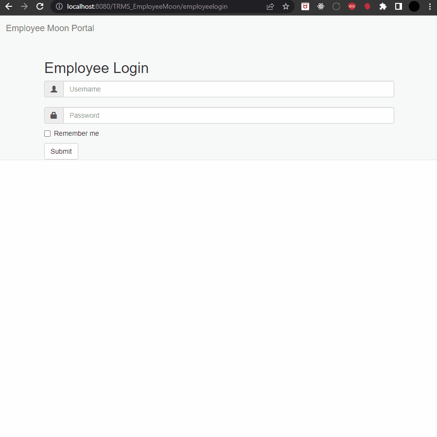

# Employee Moon 
### Tuition Reimbursement Management System
| Date       | Contributors           |
|------------|------------------------|
| 2021-01-01 | Sandra, Nagma, & Petra |

### Overview
The purpose of the Tuition Reimbursement Management System(TRMS) app is to collect essential information via the Tuition Reimbursement form, including employee details, event specifics, costs, grading format, event type, justification, missed work time, and projected reimbursement. Additionally, employees can optionally attach event-related documents.


### A. Tech Stack

| Catergory     | Contributors                                        |
|---------------|-----------------------------------------------------|
| Server Side   | `Java 8`                                            | 
| Client Side   | `HTML5`  `CSS3`  `Javascript`  `ES6`  `Bootstrap 4` | 
| Database      | `PostgreSQL 12`                                     |   
| Testing       | `JUnit 4`                                           | 
| Logging       | `log4j`                                             |
| Tools         | `Apache Tomcat 8.5 - 9`                             |
### B. Setup
1. Clone repository
    ```bash
     git clone -b main https://github.com/somoruyi/Employee-Moon.git
    ```
2. Setup your database **locally**:
   - Download and install PostgreSQL 12.
   - In `pgAdmin 4` create a new database names: **postgres**.
   - Create a new schema named: **trms**
   - Run the trms.sql file to and create new tables.
3. Install Apache Tomcat version 8.5 - 9.0. 
   - Add the project to the Apache server, and start it.
4. Run the TRMS_EmployeeMoon project in your IDE. 
   - Navigate to http://localhost:8080/TRMS_EmployeeMoon/home
5. Login with the credentials below or create your own employee credentials in the database.

### C. Authorization and Authentication
    

- Sample employee login credentials (Note: You can add employee's to the system by adding them to the database):
```sh
username: ljames
password: 23hart
```
- Approver Login creditionals:
```sh
username: benco
username: dirsup
username: dirhead
username: mgmt
username: dirmgmt
```
```sh
password: password
```

### D. Business Requirements
- Each employee is allowed to claim up to $1000.00 in tuition reimbursement per year.
- The amount available to an employee is reset on the new year.
- Event types have different standard reimbursement coverage.
- After a BenCo has approved a reimbursement, the reimbursement is "pending" until a passing grade or presentation over the event is provided.
- Employees must complete the Tuition Reimbursement form and the form must collect required information: 
  - basic employee information
  - date
  - time
  - location
  - description
  - cost
  - grading format (grade or presentation)
  - event type
  - work-related justification
  - work time that will be missed
  - projected reimbursement
  - and optionally event-related attachments

### E. Features
- Cookies
- Session Management

### F. Screenshots



